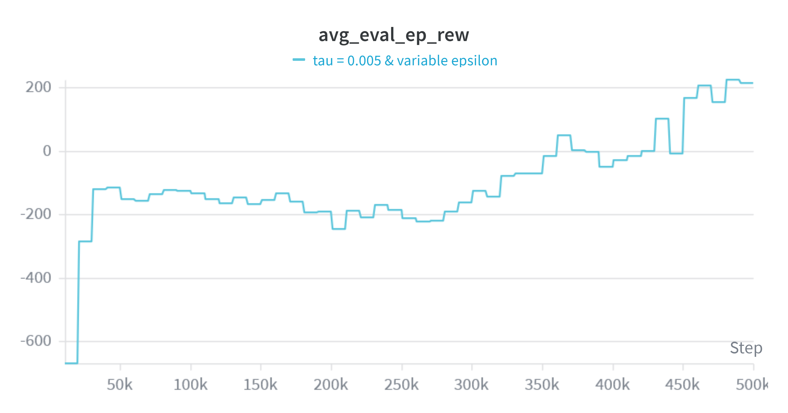
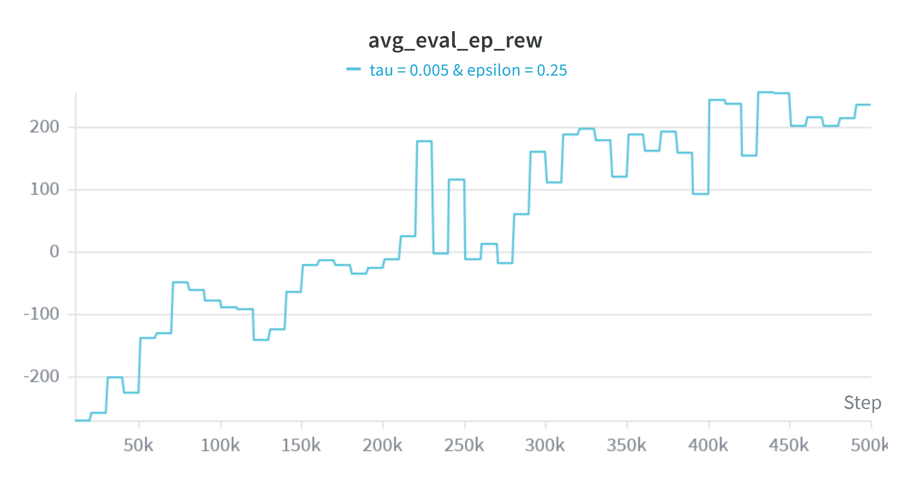
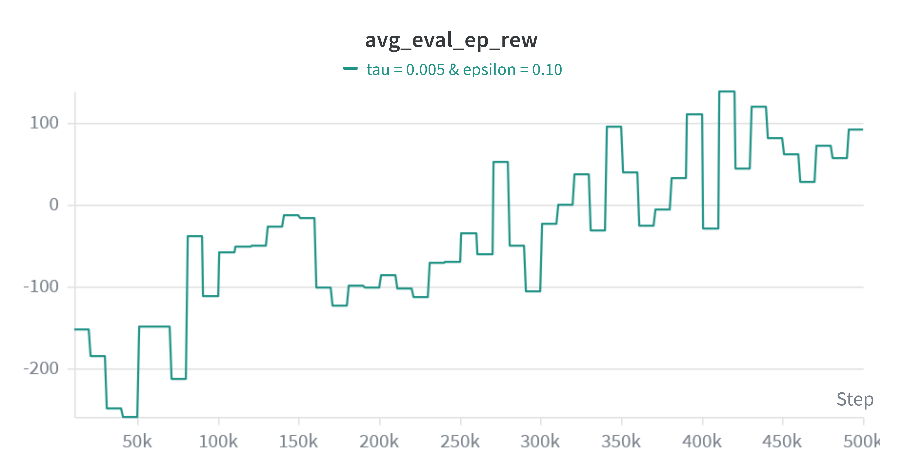
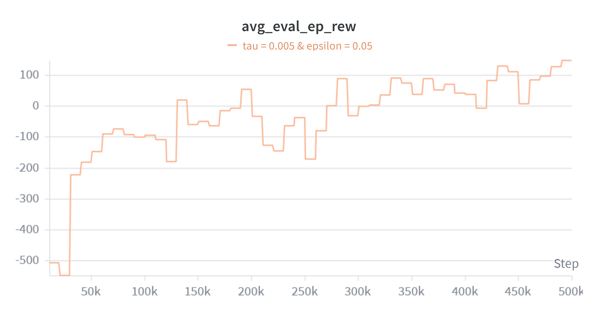
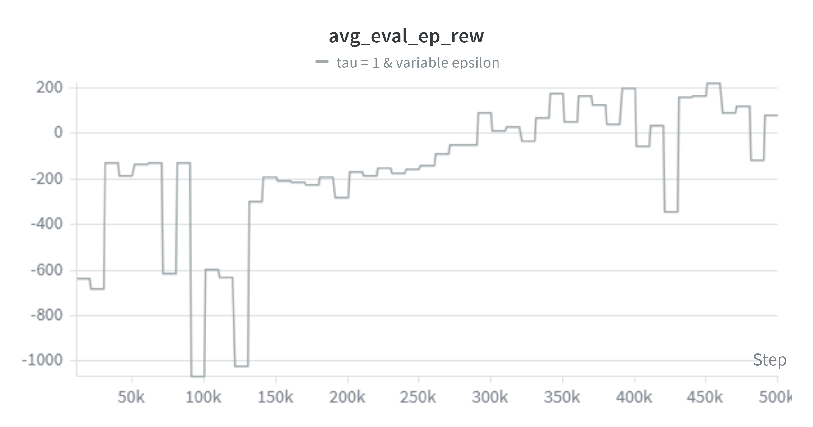
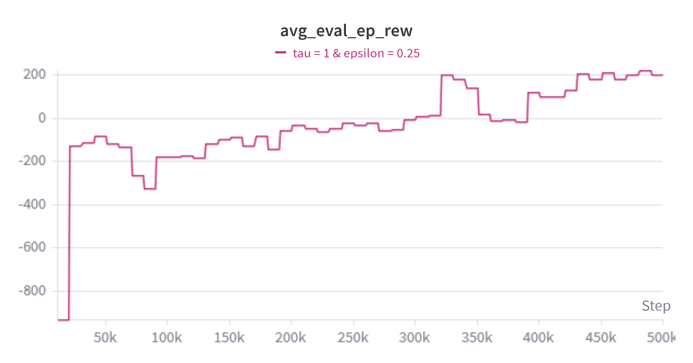
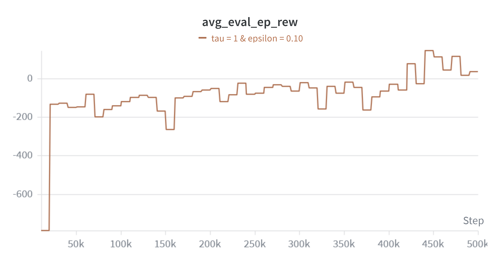
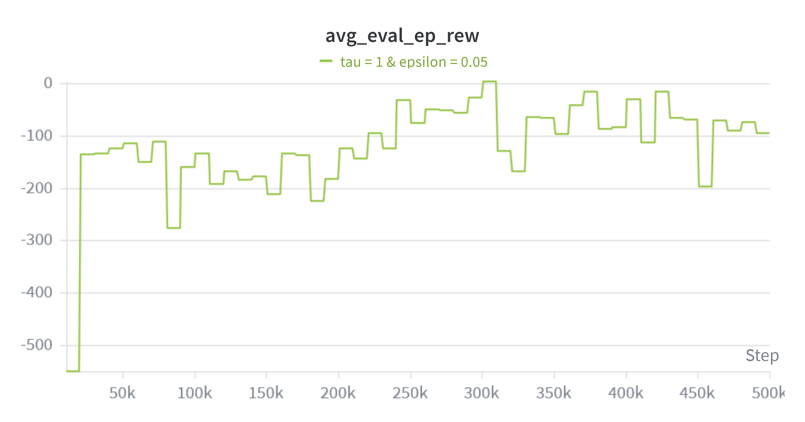
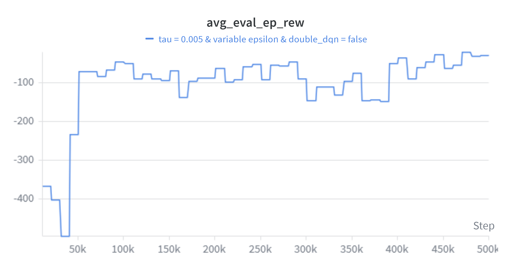

# Results of DQN

In this folder are the results for our dqn-agent.

## Plots
For every variation of settings, there is a plot:
I later realised, that double dqn is already used for these plots.

We can see how the different epsilons change how the agent learns. For epsilon=0.05, the agent learns not to crash, but does not learn how to land. The same holds for the epsilon=0.1.
For epsilon=0.25 the agent has a few good runs where he lands and the reward spikes up. He learns pretty quickly how to land, but is also very inconsistend. 
The variable epsilon takes longer to not crash and behaves pretty random, but to the end it stabilizes and the reward goes up and until it pretty constantly lands with a reward of 200.

We choose the best of the above versions to run the final experiment with double dqn on and off:

We can see here, that the double DQN trick helps the agent a lot. Without double DQN the rewards are pretty bad the whole time, but do not go up, unlike the agent with double DQN.

## Visualisation
To visualize the agent, I let AI write a script zu visualize the final run after a training. In this gif the agent got a reward of around 200.