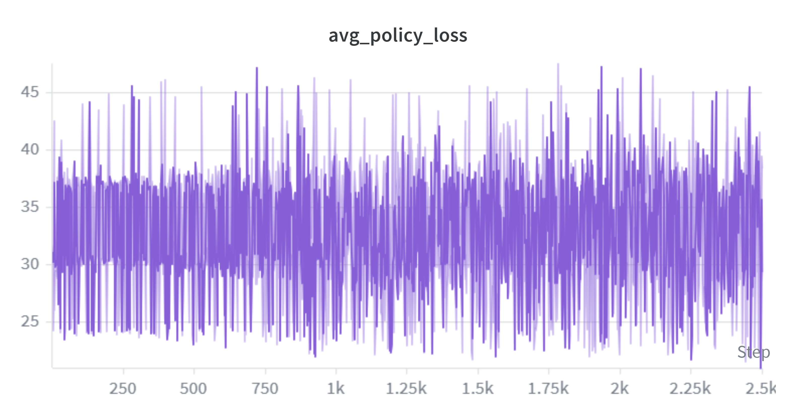
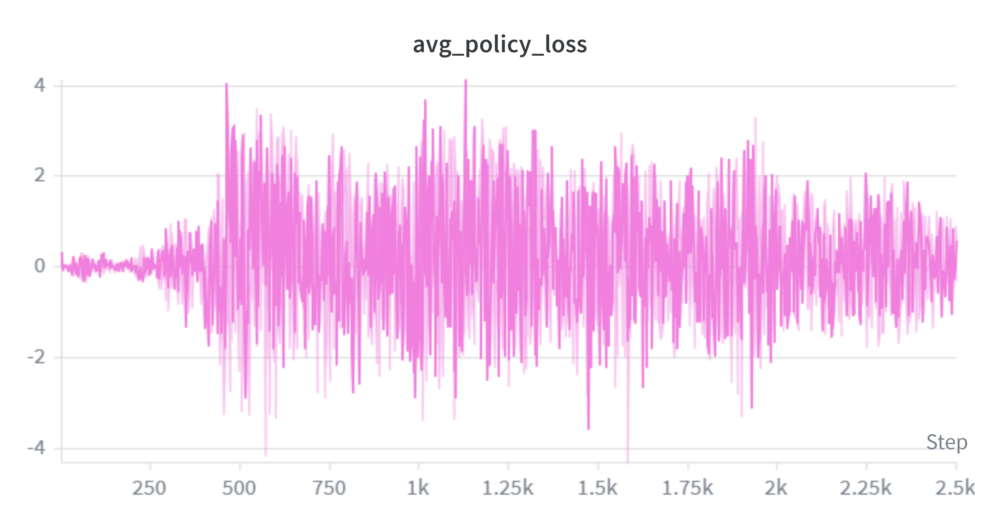
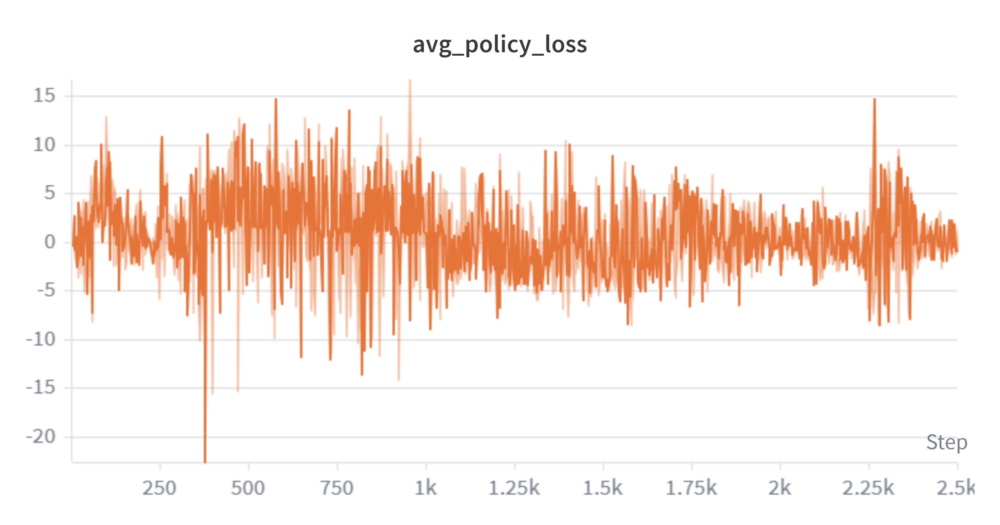
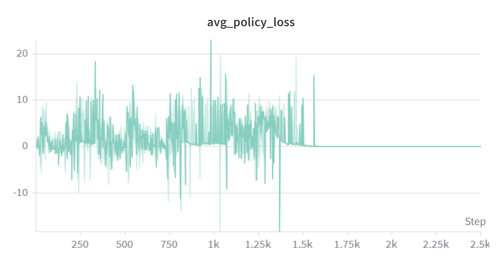
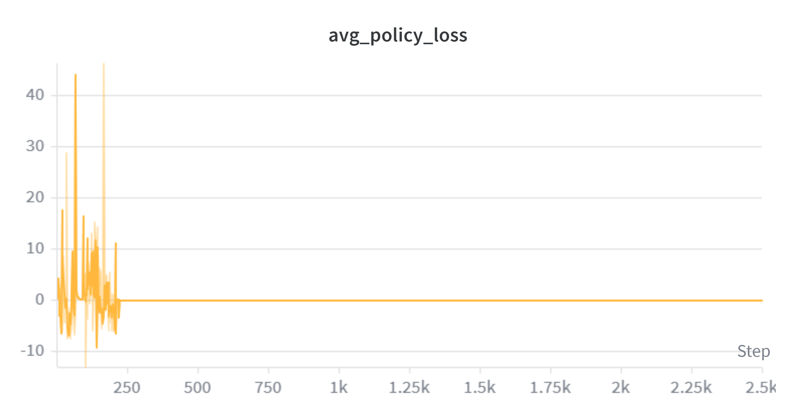

# Results of REINFORCE

In this folder are the results for our reinforce-agent.

## Plots
For every variation of settings, there is a plot:

## Visualisation
To visualize the agent, I let AI write a script zu visualize the final run after a training.